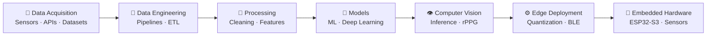

# Hi, I'm Anthony 👋🏾

**Computer Engineering** student building intelligent systems at the intersection of:

```text
Data → Machine Learning → Computer Vision → Embedded Systems
```


- 🔬 Final-year project: **[Contactless Vital Signs Monitoring System](https://github.com/anthonyy616/health-project)** — computer vision + rPPG + planned ESP32-S3 wearable
- 🧮 Background: **Cybersecurity internship** and automation/data work in Python
- 🖥️ Daily drivers: Linux, Python, C++, SQL, Docker, Git
- 📫 Reach me: [LinkedIn](https://www.linkedin.com/in/anthony-ogbuah-995957339) · [anthonyogbuah@gmail.com](mailto:anthonyogbuah@gmail.com) · [Portfolio](https://anthonyy616.vercel.app/)

<br>

## ⚙️ System Pipeline

How I think about end-to-end intelligent systems — from raw signals to hardware:



<br>

## 🧠 Current Focus

| | | | |
|:---:|:---:|:---:|:---:|
| 🔬 Computer Vision | 🧠 Deep Learning | 📊 Data Engineering | ⚙️ Embedded Software |
| 📡 IoT / BLE | 🤖 Edge AI | 🔒 Cybersecurity | 🛠️ Linux Systems |

I'm interested in the full path an intelligent system takes: **data acquisition → processing → modelling → inference → hardware/edge deployment**. My current work spans contactless health sensing with computer vision, data pipelines, and embedded sensor systems.

<br>

## 📡 Contactless Vital Signs Monitoring System

> Final-year engineering project — computer vision + signal processing for non-contact vital signs, with a planned wearable band.

**Vision pipeline (implemented):**

```text
Webcam → Computer Vision → Face / ROI Detection → Signal Processing → Vital Sign Estimation
```

**Wearable integration (in development):**

```text
ESP32-S3 → MAX30102 → MPU6050 → BLE → Monitoring Station
```

**What's implemented:** face detection (MediaPipe, 478 landmarks) · heart rate via rPPG (POS + FFT on forehead ROI) · respiration via chest-ROI optical flow · pupil dilation (iris-calibrated + EAR blink) · age estimation (MobileNetV3-Small transfer learning on UTKFace) · PyTorch with ONNX export.

**In development:** ESP32-S3 wearable band with MAX30102 + MPU6050 sensors over BLE, MLX90614 IR temperature.

**Tech:** Python · MediaPipe · OpenCV · PyTorch · NumPy · Signal Processing · rPPG · ESP32-S3 · BLE

**Status:** research / educational prototype — 57 unit tests passing. **Not a medical device and not clinically certified.**

🔗 [Repository](https://github.com/anthonyy616/health-project)

<br>

## 🛠️ Other Engineering Projects

### 📊 [data-ingest-ETL](https://github.com/anthonyy616/data-ingest-ETL) — *Data Engineering*
Multi-tenant ingestion & ETL platform: event API, S3 file ingestion with delta loading (SHA-256 fingerprints, schema validation, dedup), watermark-based DB puller, Dagster orchestration, dbt staging → marts, Terraform on AWS, CloudWatch/SNS observability.
`Python` `Dagster` `dbt` `PostgreSQL` `Terraform` `AWS` `Docker`

### 🔍 [sql-optimizer-cli](https://github.com/anthonyy616/sql-optimizer-cli) — *Systems / Data Tooling*
Unix-native CLI that analyzes SQL against a live database — real schema, indexes, and EXPLAIN plans — returning prioritized recommendations: security issues, index DDL, partitioning, rewrites, workload regression tracking, and a TUI dashboard. Supports PostgreSQL, MySQL, SQLite.
`Rust` `SQL` `PostgreSQL` `CLI` `Static Analysis`

### 🤖 [internship_automation](https://github.com/anthonyy616/internship_automation) — *Automation / AI Systems*
Autonomous agent that discovers opportunities, applies via web forms (tiered Playwright + LLM fallback), and sends self-checked cold emails. Event-sourced, replayable actions, FastAPI + arq + Postgres/pgvector, Docker deployment.
`Python` `FastAPI` `Playwright` `PostgreSQL` `Redis` `Docker`

### 🎵 [lyricqueue](https://github.com/anthonyy616/lyricqueue) — *Deep Learning / Recommender Systems*
Music recommendation engine that predicts "sonic" characteristics from lyrics alone via an RNN/Transformer, combined with multimodal embeddings (lyrics + mel-spectrograms + metadata) in a hybrid two-stage pipeline.
`Python` `PyTorch` `Transformers` `FAISS` `FastAPI`

### 🛡️ [network-traffic-detection-anomaly](https://github.com/anthonyy616/network-traffic-detection-anomaly) — *ML / Cybersecurity*
Network traffic anomaly detection applying ML algorithms to identify suspicious patterns — where my cybersecurity internship interests meet applied machine learning.
`Python` `ML` `Network Security`

### 📊 [antlyst](https://github.com/anthonyy616/antlyst) — *Data Analytics / Visualization*
Data visualization tool (from “anthony + analyst”): users upload CSV files and get data visualization dashboards in any dashboard style in under a minute. Bridges analytics and ML-style plots in a quick, no-setup workflow.
`TypeScript` `Data Visualization` `CSV Analytics` `Dashboards`

<br>

## 🔧 Engineering Domains

<details>
<summary><b>🧵 Data Engineering</b></summary>

- **Languages & Tech Stack** Python, SQL, PostgreSQL, AWS Services
- **Processing:** Pandas, NumPy, ETL/ELT design, delta loading, watermark-based sync
- **Orchestration:** Dagster jobs and schedules, dbt staging → mart layers
- **Ingestion:** REST APIs, S3 event-triggered pipelines, file schema validation
- **Evidence:** [data-ingest-ETL](https://github.com/anthonyy616/data-ingest-ETL)

</details>

<details>
<summary><b>🧠 Deep Learning & AI</b></summary>

- **Frameworks:** PyTorch (used in [health-project](https://github.com/anthonyy616/health-project) and [lyricqueue](https://github.com/anthonyy616/lyricqueue)), Scikit-learn
- **Models:** MobileNetV3-Small transfer learning (UTKFace), RNN/Transformer lyric encoders
- **Optimization:** ONNX export, INT8 quantization, CPU inference benchmarking
- **Techniques:** hybrid recommenders, embeddings, attention-based sequence models

</details>

<details>
<summary><b>👁️ Computer Vision</b></summary>

- **Face & landmark:** MediaPipe Face Landmarker (478 points), ROI extraction
- **Motion:** OpenCV Farneback optical flow, EAR-based blink detection
- **Biomedical signals:** rPPG (POS algorithm + FFT), respiration from chest motion
- **Evidence:** [health-project](https://github.com/anthonyy616/health-project)

</details>

<details>
<summary><b>⚙️ Embedded Systems & IoT</b></summary>

- **Platforms:** ESP32 / ESP32-S3, embedded C/C++ (coursework & labs)
- **Sensors:** MAX30102 (pulse oximetry), MPU6050 (IMU), MLX90614 (IR temperature) — hardware integration planned for the wearable band
- **Connectivity:** BLE for wearable-to-station sync, IoT data collection
- **Focus:** hardware/software co-design, real-time constraints, edge inference
- **Evidence:** [health-project](https://github.com/anthonyy616/health-project) (wearable in development), [school-labs](https://github.com/anthonyy616/school-labs)

</details>

<details>
<summary><b>🛠️ DevOps / Infrastructure</b></summary>

- **Containers & CI:** Docker, Docker Compose, GitHub Actions
- **IaC:** Terraform modules (VPC, RDS, ECS, Lambda, S3) in [data-ingest-ETL](https://github.com/anthonyy616/data-ingest-ETL)
- **Backend:** FastAPI, Redis task queues, PostgreSQL (incl. Neon/pgvector)
- **Tooling:** Linux, Git, GitHub, Jupyter, VS Code

</details>

<details>
<summary><b>🔒 Cybersecurity</b></summary>

- Cybersecurity internship — hands-on exposure to security operations
- ML-based network anomaly detection ([network-traffic-detection-anomaly](https://github.com/anthonyy616/network-traffic-detection-anomaly))
- Interest in secure-by-design systems, injection prevention, and secrets management

</details>

<br>

## 🧰 Tech Stack

**Languages:** Python · C/C++ · SQL · Rust · TypeScript

**Data:** PostgreSQL · Pandas · NumPy · Jupyter · dbt · Kafka

**AI / ML:** PyTorch · Scikit-learn · OpenCV · MediaPipe

**Embedded:** ESP32-S3 · BLE · Sensor interfaces (MAX30102, MPU6050) · Embedded C/C++

**Infrastructure:** Linux · Docker · Git · GitHub · Terraform

<br>

## 📚 Currently Learning

| Area | Why |
|------|-----|
| Edge AI & quantization | Getting models to run well on constrained hardware |
| Embedded Linux & real-time systems | Reliable firmware and low-latency sensing |
| MLOps | Training-to-deployment pipelines for CV models |
| Distributed data systems | Scaling pipelines beyond a single node |
| Advanced deep learning | Attention architectures, multimodal models |

<br>

## 📊 GitHub Statistics

<p align="center">
  <a href="https://github.com/anthonyy616">
    
  </a>
  <a href="https://github.com/anthonyy616">
    
  </a>
</p>

<p align="center">
  <a href="https://github.com/anthonyy616">
    
  </a>
  <a href="https://github.com/anthonyy616">
    
  </a>
</p>

<br>

## 🐍 Contribution Graph

<p align="center">
  <picture>
    <source media="(prefers-color-scheme: dark)" srcset="https://raw.githubusercontent.com/anthonyy616/anthonyy616/output/github-snake.svg" />
    <source media="(prefers-color-scheme: light)" srcset="https://raw.githubusercontent.com/anthonyy616/anthonyy616/output/github-snake-white.svg" />
    
  </picture>
</p>

<br>

## 📜 Recent Activity

<!-- START_SECTION:activity -->

*Last refreshed 2026-09-14 11:41 UTC by [GitHub Actions](.github/workflows/activity.yml).*
- **today** — pushed 1 commit(s) to `main` to [anthonyy616/zue-creations-landing](https://github.com/anthonyy616/zue-creations-landing)
- **today** — pushed 1 commit(s) to `test` to [anthonyy616/zue-creations-landing](https://github.com/anthonyy616/zue-creations-landing)
- **today** — pushed 1 commit(s) to `ui-redesign-backup` to [anthonyy616/baddiesplug-lashes](https://github.com/anthonyy616/baddiesplug-lashes)
- **today** — pushed 1 commit(s) to `ui-redesign-backup` to [anthonyy616/baddiesplug-lashes](https://github.com/anthonyy616/baddiesplug-lashes)
- **today** — pushed 1 commit(s) to `ui-redesign-backup` to [anthonyy616/baddiesplug-lashes](https://github.com/anthonyy616/baddiesplug-lashes)
- **2d ago** — pushed 1 commit(s) to `test` to [anthonyy616/baddiesplug-lashes](https://github.com/anthonyy616/baddiesplug-lashes)

<!-- END_SECTION:activity -->

<br>

## 📫 Connect

[](https://github.com/anthonyy616)
[](https://www.linkedin.com/in/anthony-ogbuah-995957339)
[](mailto:anthonyogbuah@gmail.com)
[](https://anthonyy616.vercel.app/)
